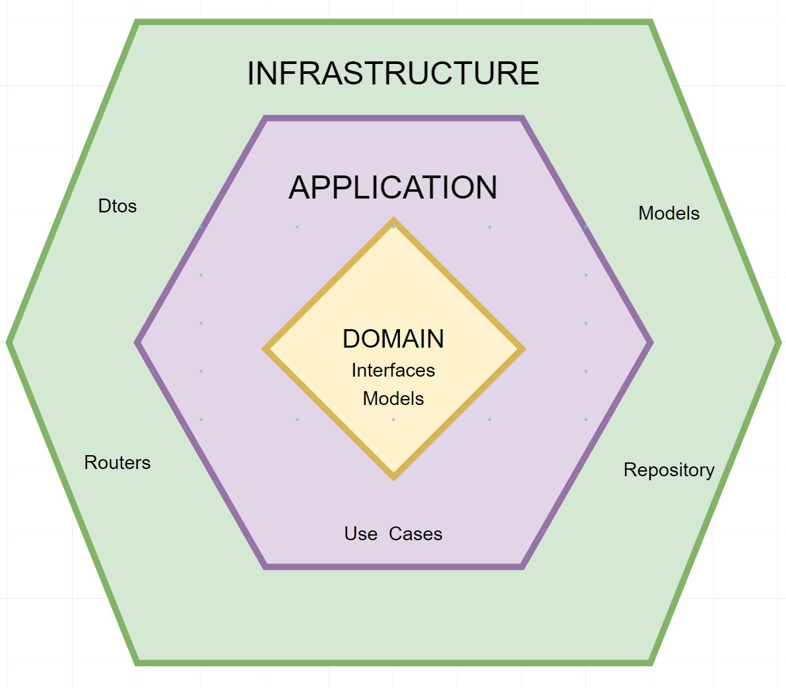

# Hexagonal-API
API RESTful con FastAPI y SQLite, con autenticación y autorización (JWT), y pruebas unitarias (pytest). Implementada con Arquitectura Hexagonal, Vertical Slice y Screaming Architecture.



## Requisitos previos

- Python 3.9.6
- Poetry

## Instalación y Ejecución

1. Clona el repositorio:
   ``` bash
   git clone git@github.com:lesmesl/hexagonal-api.git
   ```
2. Navega al directorio del proyecto:
   ``` bash
   cd hexagonal-api.git
   ```
3. Instala las dependencias:
   ``` bash
   poetry install
   ```
4. Crea el archivo de variables de entorno .env y agrega tus configuraciones:

   ``` bash
    DATABASE_URL=sqlite:///./api.db
    SECRET_KEY=tu_secreto
    ALGORITHM=HS256
    ACCESS_TOKEN_EXPIRE_MINUTES=30
   ``
5. Realiza las migraciones:
   ``` bash
   alembic upgrade head
   ```
6. Iniciar el proyecto:
   ``` bash
   poetry run uvicorn app.main:app --reload --port 8001
   ```
7. Documentación de la API:
   ``` bash
   http://localhost:8001/docs
   ```


## Documentación de Endpoints

### Productos

- **Crear Producto**
  - **URL:** `{{baseUrl}}/products`
  - **Método:** `POST`
  - **Autenticación:** Bearer Token
  - **Cuerpo de la solicitud:**
    ```json
    {
      "name": "pollo",
      "price": 27000.2,
      "in_stock": true,
      "description": "Bienvenido"
    }
    ```
  - **Descripción:** Crea un nuevo producto en la base de datos.

- **Obtener Todos los Productos**
  - **URL:** `{{baseUrl}}/products`
  - **Método:** `GET`
  - **Autenticación:** No requerida
  - **Descripción:** Obtiene una lista de todos los productos.

- **Actualizar Producto**
  - **URL:** `{{baseUrl}}/products/{id}`
  - **Método:** `PUT`
  - **Autenticación:** Bearer Token
  - **Cuerpo de la solicitud:**
    ```json
    {
      "name": "pollo",
      "price": 27000.2,
      "in_stock": true,
      "description": "Bienvenido"
    }
    ```
  - **Descripción:** Actualiza los detalles de un producto específico por su ID.


- **Eliminar producto**
  - **URL:** `{{baseUrl}}/products/{id}`
  - **Método:** `DELETE`
  - **Autenticación:** Bearer Token
  - **Descripción:** Elimina un producto específico por su ID.


### Usuarios

- **Registrar Usuario**
  - **URL:** `{{baseUrl}}/users/register`
  - **Método:** `POST`
  - **Autenticación:** No requerida
  - **Cuerpo de la solicitud:**
    ```json
    {
      "username": "usuario",
      "password": "contraseña"
    }
    ```
  - **Descripción:** Registra un nuevo usuario en la aplicación.

- **Iniciar Sesión**
  - **URL:** `{{baseUrl}}/users/login`
  - **Método:** `POST`
  - **Autenticación:** No requerida
  - **Cuerpo de la solicitud:**
    ```json
    {
      "username": "usuario",
      "password": "contraseña"
    }
    ```
  - **Descripción:** Inicia sesión y obtiene un token de acceso.

- **Obtener Perfil de Usuario**
  - **URL:** `{{baseUrl}}/users/me`
  - **Método:** `GET`
  - **Autenticación:** Bearer Token
  - **Descripción:** Obtiene la información del perfil del usuario autenticado.


## Pruebas unitarias
1. Ejecuta las pruebas unitarias:
   ``` bash
   pytest
   ```

## Utilidades
1. Ejecuta el linter y formateador de código:
   ``` bash
   poetry run lint_and_format
   ```
2. Ruta de colecciones de documentación API Postman:
   ``` bash
   docs/collections/
   ```

 
## Estructura del Proyecto
``` bash
HEXAGONAL-API/
├── app/
│   ├── config/
│   │   ├── config.py                 # Declaración de las constantes y variables necesarias
│   │   ├── constants.py              # Definición de constantes utilizadas en la aplicación
│   │   ├── database.py               # Configuración de la base de datos y creación de sesiones
│   │   ├── error_handlers.py         # Manejadores de errores personalizados
│   │   ├── exceptions.py             # Definición de excepciones personalizadas
│   │   ├── fastapi_config.py         # Configuración específica de FastAPI
│   │   ├── security.py               # Configuración de seguridad (JWT, OAuth2, etc.)
│   ├── products/
│   │   ├── application/
│   │   │   ├── use_cases.py          # Casos de uso relacionados con productos
│   │   ├── domain/
│   │   │   ├── model.py              # Entidad que define el producto
│   │   │   ├── repository_interface.py # Interfaces de repositorios para productos
│   │   ├── infrastructure/
│   │   │   ├── dtos.py               # Schemas de Pydantic para productos
│   │   │   ├── models.py             # Modelos de SQLAlchemy para productos
│   │   │   ├── repository.py         # Implementación del repositorio de productos
│   │   │   ├── router.py             # Rutas del API para productos
│   ├── users/
│   │   ├── application/
│   │   │   ├── use_cases.py          # Casos de uso relacionados con usuarios
│   │   ├── domain/
│   │   │   ├── model.py              # Entidad que define el usuario
│   │   │   ├── repository_interface.py # Interfaces de repositorios para usuarios
│   │   ├── infrastructure/
│   │   │   ├── dtos.py               # Schemas de Pydantic para usuarios
│   │   │   ├── models.py             # Modelos de SQLAlchemy para usuarios
│   │   │   ├── repository.py         # Implementación del repositorio de usuarios
│   │   │   ├── router.py             # Rutas del API para usuarios
│   ├── __init__.py                   # Inicialización del paquete
│   ├── main.py                       # Punto de entrada de la aplicación
├── tests/
│   ├── conftest.py                   # Configuraciones para las pruebas
│   ├── application/                  # Pruebas relacionadas con la capa de aplicación
│   ├── config/                       # Pruebas relacionadas con la configuración
│   ├── infrastructure/               # Pruebas relacionadas con la infraestructura
│   └── __init__.py                   # Inicialización del paquete de pruebas
├── alembic/
│   ├── versions/                     # Carpeta donde se almacenan las migraciones
│   ├── env.py                        # Archivo de entorno para Alembic donde se indican los modelos a crear
│   └── script.py.mako                # Plantilla para scripts de migración
├── scripts/                          # Scripts de inicialización o mantenimiento
│   ├── lint_and_format.py            # Script de desarrollo para aplicar linter y formatear código
├── docs/                             # Documentación adicional
│   ├── collections/                  # Colecciones de documentación
│   ├── diagram_infra.png             # Diagramas de infraestructura
├── alembic.ini                       # Archivo de configuración de Alembic
├── pyproject.toml                    # Archivo de configuración de Poetry
├── README.md                         # Documentación del proyecto
└── .env_example                      # Archivo de ejemplo de variables de entorno
``` 
